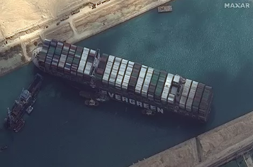

# Data-Structures-Course

Problem situation - The Suez Canal
In March 2021, strong winds battered the vessel called the Ever Given as it passed through the Suez Canal. The ship carrying 20,000 containers and measuring more than 400 meters in length ended up wedged in the waterway with its bow and stern stuck on the banks of the canal, blocking all traffic.

If we consider that 12% of global trade, around a million barrels of oil and approximately 8% of liquefied natural gas pass through the canal every day, the impact of this event is clear. During the six days that this situation lasted, it is estimated that losses amounted to 9.6 billion dollars per day.

This event, combined with the increase in demand caused by the COVID-19 pandemic, has shown the need for software that allows better control of the products passing through the stalls, in addition to selecting alternative routes that allow the required products to reach their final destination with the least possible delay. To do this, it is necessary to collect and process all the information that allows us to develop strategies that allow us to avoid or mitigate similar future problems. But,

How can we store all that data in a proper way?
What can we do to perform more efficient searches?
How do we find an alternative route between two given ports?
How can we analyze data to generate useful information?
These, and some more questions, we will be solving throughout this course. So, let's get started!

